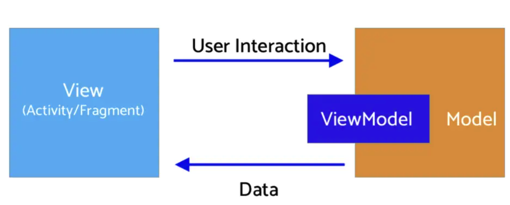
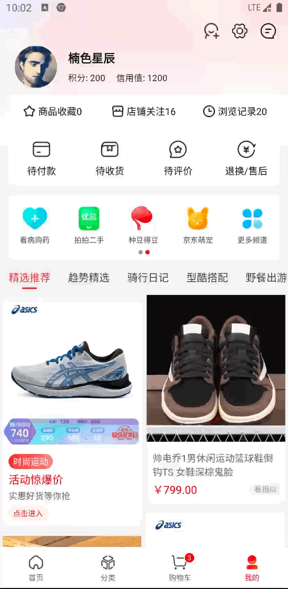

# 前言
高仿京东商城项目具有完整的结构，代码整洁规范，结构清晰，集成React-Native热更功能，功能还在持续更新中...如果对你有帮助，给个star
1. 使用kotlin语言开发，项目使用模块化开发，降低了耦合性
2. 网络使用 retrofit2 + okhttp3方式，进行了高度的封装
3. [使用leakcanary 内存泄漏检测](https://github.com/square/leakcanary)
4. [基于MVI架构(airbnb的Mavericks)开发](https://airbnb.io/mavericks/#/README)
5. [使用本地mock模拟服务端](https://github.com/mirrajabi/okhttp-json-mock)
6. [采用ARouter路由管理](https://github.com/alibaba/ARouter/tree/master)
7. 集成RN热更功能， 用户设置为rn写的页面，[rn工程请见](https://github.com/GuoguoDad/mall_page.git)

# MVI架构

由于没有明确的状态管理标准，随着应用程序的增长或添加功能或事先没有计划的功能，视图渲染和业务逻辑可能会变得有点混乱，并且这种情况经常发生在Android应用开发过程中。可能你经常遇到状态管理导致业务逻辑和 UI 渲染的分工不明确，最终导致应用架构的混乱。而新提出的MVI架构，提倡一种单向数据流的设计思想，非常适合数据驱动型的UI展示项目。MVI的架构思想来源于前端，由于Model、View和Intent三部分组成。

* Model: 与其他MVVM中的Model不同的是，MVI的Model主要指UI状态（State）。当前界面展示的内容无非就是UI状态的一个快照：例如数据加载过程、控件位置等都是一种UI状态
* View: 与其他MVX中的View一致，可能是一个Activity、Fragment或者任意UI承载单元。MVI中的View通过订阅Intent的变化实现界面刷新（不是Activity的Intent、后面介绍）
* Intent: 此Intent不是Activity的Intent，用户的任何操作都被包装成Intent后发送给Model进行数据请求

# 下载（已废弃，需自己下载源码编译）

##Apk下载链接： [Apk下载链接](https://www.pgyer.com/FYfa)

##Apk二维码

# 首页

# 分类

# 购物车

# 我的

# 商品详情

# 我的-设置(rn页面-拉取远程的bundle)

# 第三方库
| 库                       | 功能                      |
| ----------------------- | ----------------------    |
| **retrofit2**           | **网络**                   |
| **okHttp3**             | **网络**                   |
| **mavericks**           | **MVI框架**                |
| **BaseRecyclerViewAdapterHelper**  | **万能适配器**   |
| **PhotoView**           | **图片预览**                |
| **ARouter**             | **组件化路由**              |
| **coil**                | **图片加载**                |
| **XPopup**              | **弹窗组件**                |
| **banner**              | **滚动图**                  |
| **SmartRefreshLayout**  | **智能下拉刷新框架**         |
| **gson**                | **json解析**                |
| **leakcanary**          | **内存泄漏检测库**           |

# 声明
⚠️本APP仅限于学习交流使用，请勿用于其它商业用途

⚠️项目中使用的图片及字体等资源如有侵权请联系作者删除

⚠️如使用本项目代码造成侵权与作者无关