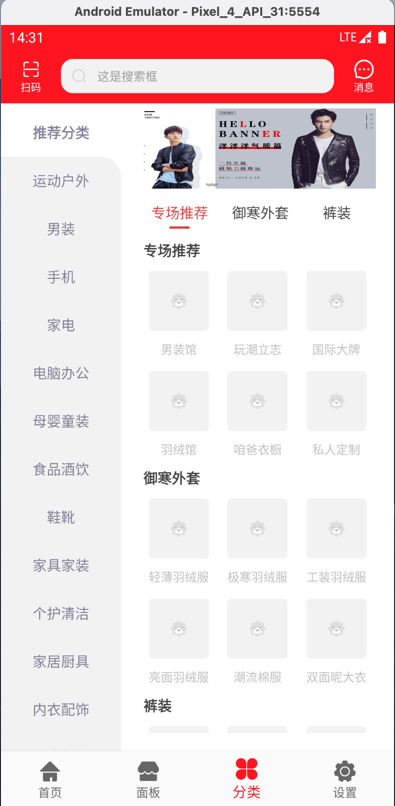

# 前言

android_template 是本人学习android的练手项目，项目具有完整的结构。代码整洁规范，结构清晰。

1. kotlin

2. [基于MVI架构airbnb的Mavericks](https://airbnb.io/mavericks/#/README)

3. 多模块、本地mock

4. [alibaba ARouter](https://github.com/alibaba/ARouter/tree/master)

# 项目展示

